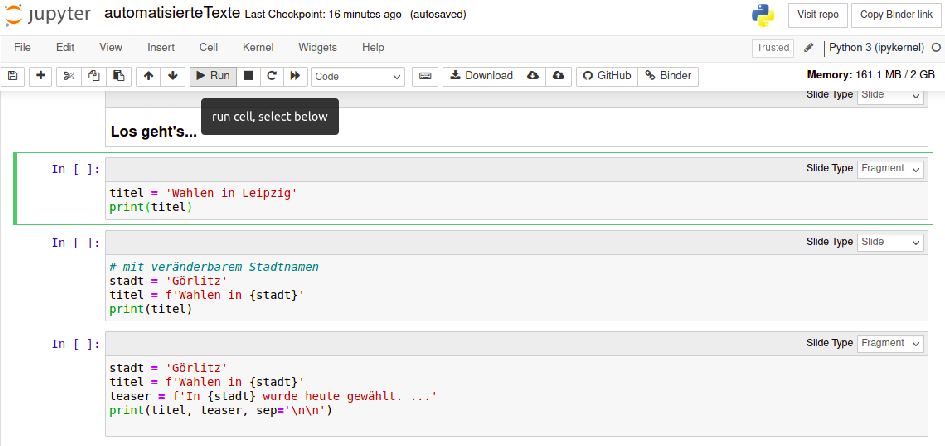

# Getting Started 

Dieses Workbook basiert auf [Jupyter Books](https://executablebooks.org/en/latest/). Jupyter Books ist ein Open-Source Projekt, dass die Erstellung von gut formattierte Tutorials oder Online Bücher mit Text, Code und Visualisierungen vereinfacht.

Der größte Vorteil des Workbooks ist die Interaktivität. Nutzer:innen können ein Live Jupyter Session starten und nach Belieben mit dem Code experimentieren.

## Mit Jupyter Notebooks interagieren

Interaktive Inhalte haben oben rechts eine kleine Rakete mit zwei Auswahlmöglichkeiten: `Binder` und `Google Colab`.

Beide öffnen einen neuen Browsertab mit dem entsprechenden Jupyter Notebook. Während `Binder` meist etwas länger lädt, kann man im Gegensatz zu `Colab` ganz ohne Google Account den Code starten.

Ein Jupyter Notebook besteht aus sogenannten Zellen. Diese beinhalten entweder Text oder Code.
Um eine Zelle auszuführen, wird diese durch einen Klick ausgewählt und über en `Run` Button gestartet. Die Ausgabe erscheint direkt unter der ausgeführten Zelle.

Der Code kann jetzt nach Belieben abgeändert, gekürzt oder ergänzt werden und das Ergebnis passt sich direkt mit an.

**Aber Achtung!!!** Die Änderungen werden nicht gespeichert. Beim erneuten Aufrufen über das Workbook sind die Jupyter Notebooks wieder im Originalzustand.
Veränderte Notebooks können jedoch jederzeit als `.py` oder `.ipynb` Datei heruntergeladen oder auf Github oder Google gespeichert werden.

## Mehr Informationen 

Ohne die genannten Open Source Tools und Frameworks wäre dieses Workbook nicht möglich.

Für alle die diesen Kosmos besser verstehen möchten, gibt es Links mit mehr Informationen zu den genannten Tools in dieser Liste:

- [Jupyter Notebook](https://jupyter.org/)
- [Jupyter Notebooks Einführung](https://jupyter-tutorial.readthedocs.io/de/latest/intro.html)
- [Jupyter Book](https://jupyterbook.org/en/stable/intro.html)
- [Google Colab](https://colab.research.google.com/)
- [Binder](https://jupyter.org/binder)